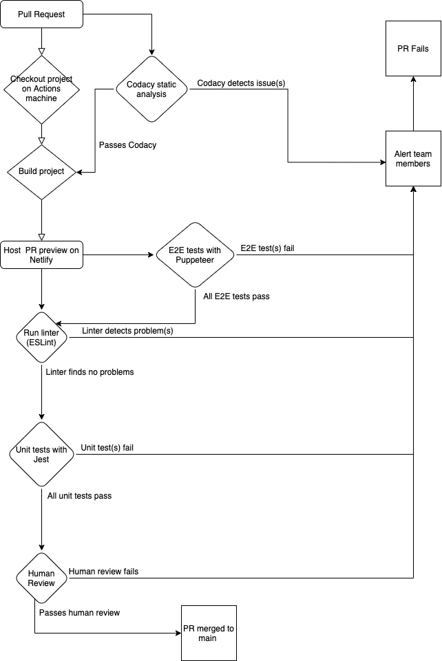

# CI/CD Pipeline Overview
### Overview of our current pipeline:
Currently, our pipeline is entirely finished. We have set up unit and end-to-end testing set up via Jest/Jest-Puppeteer. All unit tests can be run locally by typing `npm run test-unit` into the console. All end-to-end tests can also be run locally by typing `npm run test-e2e` into the console. Finally, if a developer wanted to run all tests, they can type in `npm run test` which will trigger both unit and e2e tests. 

For our file formatting and styling, we utilized ESLint and Prettier. To format our code, we utilized the Airbnb style guide. Linting can be run locally by typing `npm run lint` which will automatically format code. This will also automatically show any styling or formatting errors that linting could not automatically format. To just check for styling errors, type `npm run test-lint`. 

We have it set up such that a developer cannot merge their code into the main branch if their commit doesn't pass all unit, E2E, and linting tests. This is to ensure our main branch stays as clean as possible and is safe. 

Once the commit passes all the tests, developers can move to creating a Pull Request (PR) on GitHub. We currently have Netlify set up to automatically deploy a version of the application using that branch. This allows other developers to test the changes in the PR without having to pull the repository to their local machines (makes PR reviewing much easier). 

PRs must currently be reviewed by at least 1 other person before even allowing the PR to be merged into main. Apart from this, there are 2 workflows set in place. The first workflow is called 'build', and it mimics local workflows (unit/e2e tests, linting/styling tests). It runs the unit tests, end to end tests (on the Netlify branch preview hosting), and linting tests with ESlint. These all run on Github Actions.

The second workflow is called 'JSDocs', and it automatically generates documentation for the project. Specifically, it generates documentation for each PR (as well as main). Documentation for each PR is given by 'docs-pr-' with the pull request number appended to the end of the name. This branch is used to publish the GitHub Pages site, which displays all of the branch's documentation in an easy, readable format. A human reviewer can then verify the documentation for the changes in the PR is adequate and up to standards easily. To view all of the documentaion associated with the 'main' branch, just navigate to the 'gh-pages' branch and publish it on GitHub Pages. 

Finally, we are also utilizing Codacy to implement automatic code quality reviewing. We can view the Codacy page to check for any errors or failure points. This allows developers to know and fix potential issues with their PR and resubmit it for reviewing. Codacy displays information on the PR itself and also has its own client for looking at detailed feedback and specific issues with code quality.

Finally, a human reviewer must look at the PR and the hosted preview on Netlify and verify everything is working as intentioned. This human reviewer reads every line of code that is changed (outside of dependencies/generated code) and verifies all other functionality in the application works as planned. 

After the human reviewer approves the changes, the PR can now be merged into main. Deployments will occur when a few PRs are merged into main and it has been determined by the team a release is appropriate (when enough features/bugfixes are accumulated). 

Diagram:

