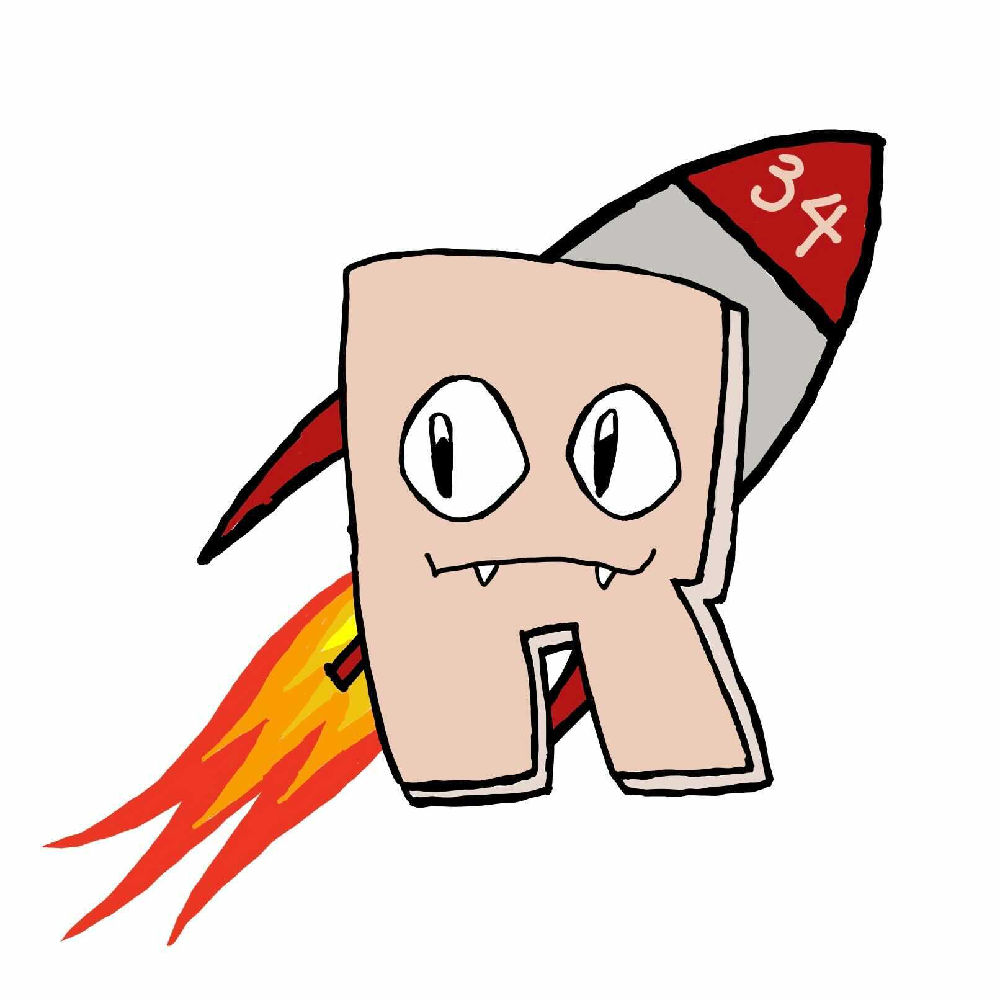

# Meeting Notes Team Rocket
**Date Here** 
## Objective
What is our Objective for our Meeting? Why was it called?
## Present
- List of members who are Present
## Absent
- Members absent for this meeting
## Summary of Last Meeting
Brief Description of what occured took place last time. What topics were discussed and whether they were approved, disaproved, or implemented.
## Discussion
1. List of topics discussed for this meeting
   - bullets describing idea
   - and other details
## Additional Info
Any Additional Resources such as links, videos that don't fit particularly well in any of the ascribed categories
## Adjournment
What time the meeting was Adjourned and by whom, as well as where the next meeting will be held and when\

**Minutes Submitted by:** 

